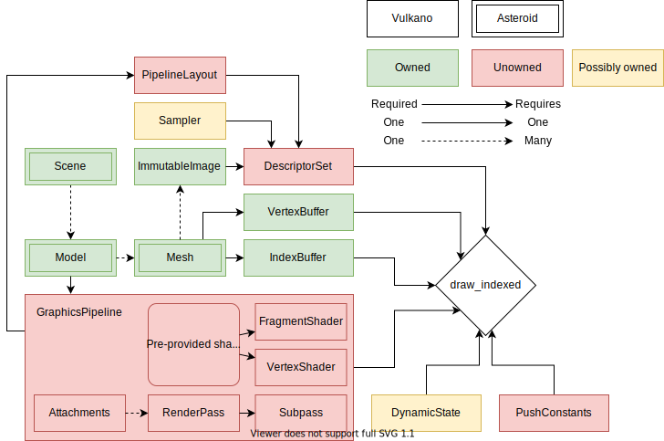

# asteroid   

Very simple 3D rendering engine with a Vulkan backend. Utilizes [vulkano](https://github.com/vulkano-rs/vulkano)
for bindings and vulkano-win for window creation.

## Goals

* GUI system
* Small renderer
* glTF/PBR support?

## Non-goals

* Physics/ECS integration
* Scene modification
* Event systems, AI systems, or networking

Although asteroid won't ship with these components, they should be relatively
easy to integrate.

## TODO

* [X] First triangle
* [ ] More robust pipelines
    * [ ] More robust shader system
    * [ ] Uniforms
* [ ] Mesh support
    * [ ] OBJ
    * [ ] Height maps
* [ ] GUI system (imgui, or nuklear if it ever stabilizes in rust)

